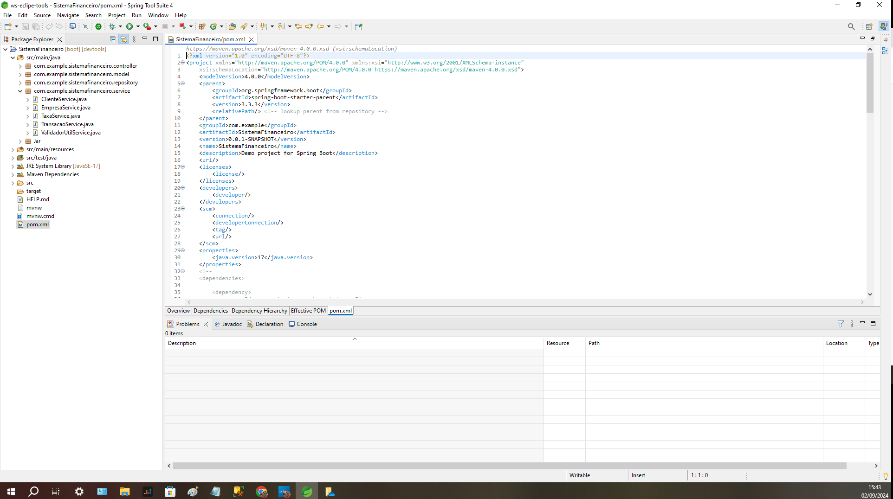

# Projeto de Teste - Java Developer

Este repositório contém o projeto desenvolvido como parte do teste técnico para a vaga de Java Developer. O objetivo deste teste é demonstrar habilidades técnicas e práticas no desenvolvimento de software utilizando Java, Spring Boot e banco de dados SQL Server.

## Descrição do Projeto

O projeto consiste em um sistema de gestão financeira que permite operações básicas de transações financeiras entre clientes e empresas, com validações específicas para CPF (clientes) e CNPJ (empresas), além de notificações e callbacks simulados.

### Funcionalidades Implementadas

1. **Validação de CPF e CNPJ**:
   - Implementação de métodos para validar CPF e CNPJ, garantindo que apenas números válidos sejam processados no sistema.

2. **Gestão de Transações**:
   - Criação de operações básicas para depósito e saque, considerando as taxas de administração aplicadas pelas empresas.

3. **Simulação de Notificações e Callbacks**:
   - Implementação de uma simulação de envio de notificações para clientes e callbacks para empresas utilizando ferramentas externas.

### Tecnologias Utilizadas

- **Java 11**: Linguagem principal para o desenvolvimento do backend.
- **Spring Boot 2.x**: Framework utilizado para facilitar a criação de uma aplicação robusta e escalável.
- **SQL Server**: Banco de dados relacional utilizado para armazenar dados do sistema, com tabelas criadas localmente.
- **Spring Tool Suite 4 (STS)**: IDE utilizada para o desenvolvimento de todo o código do projeto.

## Qualidades Demonstradas

- **Proatividade e Planejamento**: Desde o início do projeto, houve um planejamento claro das etapas necessárias para o desenvolvimento. A escolha do ambiente de desenvolvimento e a configuração do banco de dados foram realizadas de forma eficiente.
  
- **Conhecimento em Java e Spring Boot**: Foi demonstrado um bom domínio do framework Spring Boot, com a implementação correta de serviços RESTful e lógica de negócios utilizando Java.

- **Modelagem de Dados e SQL**: Criação e configuração de tabelas no SQL Server local, com um entendimento claro das necessidades de armazenamento e manipulação de dados.

- **Atenção aos Detalhes e Validação de Dados**: Implementação de lógica de validação de CPF e CNPJ, garantindo a integridade dos dados processados.

---

 
<h1 align="center">
    
</h1>
